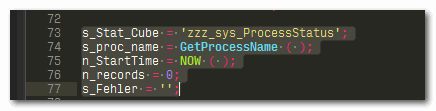

# tm1-sublime
IBM Cognos TM1 syntax highlighting for Sublime Text

## Installation
For syntax highlighting you only need to go through steps 1 and 2.  
If you want to use feature 4 to convert functions to the form as in the IBM Cognos TM1 Reference Guide, you additionally need to follow steps 3 and 4.  

1. Get Sublime Text [here](https://www.sublimetext.com/3) (also available as portable version for Windows) and install it
2. Copy folder __TM1__ to `..\Sublime Text\Data\Packages\User\TM1`
3. The feature to convert functions to the form as in IBM Cognos TM1 Reference Guide, requires installation of the __RegReplace__ package (plugin). The easiest way to deal with the installation of plugins in Sublime Text is via "Package Control" (plugin manager for Sublime Text).  
  a. So first install __Package Control__. Instructions can be found [here](https://www.granneman.com/webdev/editors/sublime-text/packages/how-to-install-and-use-package-control/).  
  b. Next, install required __RegReplace__ package & recommended packages. See aforementioned link and then the instructions under "Usage" (regarding step 2, when typing, look for "Install Package").  
  A video that shows steps a and b is available [here](https://youtu.be/NID3p0okzYQ).
4. Copy the three files in folder __RegReplace__ to `..Sublime Text\Data\Packages\User`

## Usage
1. Set color scheme for TM1 syntax highlighting: `Preferences >> Color Scheme >> User >> TM1 >> TM1_Sublime`  
Other available color schemes are: `TM1_Sublime_Highlight_Loose` (see Feature 3) and `TM1_NotepadPP`
2. To assign TM1 syntax highlighting to a file: `View >> Syntax >> TM1`, or click current syntax in bottom-right corner, and choose `TM1`  

3. Automatically convert all TM1 functions to capitalization as per IBM Cognos TM1 Reference Guide:  
Shortcut: `Ctrl+Shift+P` >> type `tm1…` and choose `Strict Naming`  
  
Will be applied to whole file if no selection exists

## Features
1.	The TM1 syntax highlighting is based on the Notepad++ version, but it has a dark theme to improve on readability.  
  a. Background is dark, but not completely black  
  b. Comments are displayed in dark gray  
  c. Strings are displayed in yellow  
  d. Numbers are displayed in purple  
  e. Operators like = , ; ( ) + etc. are displayed in dark red  
  f. TM1 control statements like If, While etc. are displayed in green  
  g. Majority of TM1 functions is displayed in light blue and bold  
  h. TM1 functions without arguments are displayed in green and bold  
  i. TM1 variables are displayed in yellow and bold  
  j  Specific rules functions like FEEDERS, FEEDSTRINGS and SKIPCHECK are displayed in pink and bold  
  k. Everything else is displayed in white
  
2. The Notepad++ version hasn’t been updated for years. The Sublime Text version includes all functions from TM1 version 10.3.

3.	The Notepad++ syntax highlighter supports 3 "flavors" of functions (all uppercase (CELLPUTN) , all lowercase (cellputn), and case according to IBM Cognos TM1 Reference Guide (CellPutN).  
The Sublime TM1 syntax highlighter highlights all functions regardless of their capitalization, but it highlights the functions that are __not__ capitalized according to Reference Guide in italics.  
  
These italics are not really in your way when reading code, but still visible enough to notice that the function is not written "correctly".  
I included an additional version of the syntax highlighter that will show these “incorrect” functions with inversed colors so that these really stand out.  

4. I included an additional feature that will automatically convert all functions to the form as stated in the IBM Cognos TM1 Reference Guide.  
You simply run a command and everything will be adjusted to correct and consistent form.  
  

## Required Sublime Text package
1. __RegReplace__: Plugin for “Sublime Text” that allows the creating of commands consisting of sequences of find and replace instructions

## Recommended Sublime Text Packages
1. __Package Control__: The Sublime Text package manager: https://packagecontrol.io/
2. __Alignment__: Alignment of selections  
Shortcut: `Ctrl+Alt+A`  
_Before_:  
  
_After_:  

3. __All Autocomplete__: Extends the default autocomplete to find matches in all open files. By default Sublime only considers words found in the current file
4. __AppendSemiColon__: Appends semi colon at the end of a line (regardless of where the cursor is positioned on a line)
Shortcut: `Ctrl+`;
5. __Expand Selection to Quotes__: Expands selections to the closest containing pairs of single or double quotes  
Shortcut: `Ctrl+’`  

6. __SideBarEnhancements__: Enhancements to Sublime Text Side Bar  

7. __Trimmer__: For cleaning up whitespace  
Shortcut: Trim Trailing Whitespace: `Ctrl+Alt+S`  

## Sublime Text
A couple of Sublime Text features that I would like to emphasize:

1. Sublime Text has a Side Bar that acts as a file browser. You can drag folders and files onto this Side Bar and __browse/preview processes and rules without ever leaving the editor__.
2.	It includes a Minimap that displays the open file and allows for very quick navigation (faster than scrolling).
3.	A feature that makes it rather unique is “multiple cursors”.  
  a. `Alt+F3` gives a really simple way to do find and replace: Use it to select all occurrences of the current word or selection, then just start typing to replace or edit them all at once.  
  b. Use multiple selections to edit in more than one place at once. It works as a quick substitute for find and replace, or to apply the same sequence of changes to multiple lines simultaneously.  
  To select multiple regions using the keyboard, select a block of text, then press `Ctrl+Shift+L` to split it into one selection per line.
4. __Toggle Comment__ (works on multiple lines)  
Shortcut: `Ctrl+/`  

5. I pre-configured Sublime Text so that:  
  a. Trailing whitespace is automatically trimmed on save.  
  b. If not present, an empty new line at eof is created on save.  
See file `Other_Assets\Preferences.sublime-settings`.
6.	If you don’t like the default font of Sublime Text, here are couple of good suggestions for coding fonts: http://t3n.de/news/coding-fonts-8-besten-schriften-678847/  
I’m using for example the “Input” font and that’s also the font you see in the screenshots. 

## TODO
1. __Code suggestions__ will be given as you type and __code snippets__ can be inserted (tab key will allow you to jump from argument to argument).  
  

2. Since Sublime Text includes a Python-based plugin API, I’m currently investigating the options to incorporate a Python-based __interface to the TM1 REST API__ (see https://github.com/MariusWirtz/TM1py) as a Sublime Text plugin.  
That would enable “hot deployment” of processes and rules through the TM1 REST API. This means that you could code/update processes and rules in Sublime Text and deploy directly to TM1 without a restart.
3. TM1 __code prettifier__.
