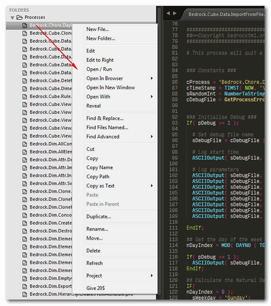

# tm1-sublime
IBM Cognos TM1 syntax highlighting for Sublime Text

## Installation
1. Get Sublime Text [here](https://www.sublimetext.com/3)
2. Copy folder __TM1__ to `..\Sublime Text\Data\Packages\User\TM1`
3. Copy the two files in folder __RegReplace__ to `..Sublime Text\Data\Packages\User` (reguires RegReplace Sublime Text Package)

## Usage
1. Change color scheme to TM1_Sublime: `Preferences >> Color Scheme >> User >> TM1 >> TM1_Sublime`  
Other available color schemes are: `TM1_Sublime_Highlight_Loose` (see Feature 3) and `TM1_NotepadPP`
2. If you Copy and Paste data to a new file in

## Features
1.	The TM1 syntax highlighting is based on the Notepad++ version, but it has a dark theme to improve on readability.  
  a. Background is dark, but not completely black  
  b. Comments are displayed in dark gray  
  c. Strings are displayed in yellow  
  d. Numbers are displayed in purple  
  e. Operators like = , ; ( ) + etc. are displayed in dark red  
  f. TM1 control statements like If, While etc. are displayed in green  
  g. Majority of TM1 functions is displayed in light blue and bold  
  h. TM1 functions without arguments are displayed in green and bold  
  i. TM1 variables are displayed in yellow and bold  
  j  Specific rules functions like FEEDERS, FEEDSTRINGS and SKIPCHECK are displayed in pink and bold  
  k. Everything else is displayed in white
  
2. The Notepad++ version hasn’t been updated for years. The Sublime Text version includes all functions from TM1 version 10.3.

3.	The Notepad++ syntax highlighter supports 3 "flavors" of functions (all uppercase (CELLPUTN) , all lowercase (cellputn), and case according to IBM Cognos TM1 Reference Guide (CellPutN).  
The Sublime TM1 syntax highlighter highlights all functions regardless of their capitalization, but it highlights the functions that are __not__ capitalized according to Reference Guide in italics.  
  
These italics are not really in your way when reading code, but still visible enough to notice that the function is not written "correctly".  
I included an additional version of the syntax highlighter that will show these “incorrect” functions with inversed colors so that these really stand out.  

4. I included an additional feature that will automatically convert all functions to the form as stated in the IBM Cognos TM1 Reference Guide.  
You simply run a command and everything will be adjusted to correct and consistent form.  
  

## Required Sublime Text package
1. __RegReplace__: Plugin for “Sublime Text” that allows the creating of commands consisting of sequences of find and replace instructions.  
Shortcut: __Ctrl+Shift+P__ >> type __tm1…__  
  
Applies to whole file if no selection exists.

## Recommended Sublime Text Packages
1. __Package Control__: The Sublime Text package manager: https://packagecontrol.io/
2. __Alignment__: Alignment of selections  
Shortcut: __Ctrl+Alt+A__  
_Before_:  
  
_After_:  

3. __All Autocomplete__: Extends the default autocomplete to find matches in all open files. By default Sublime only considers words found in the current file
4. __AppendSemiColon__: Appends semi colon at the end of a line (regardless of where the cursor is positioned on a line)
Shortcut: __Ctrl+__;
5. __Expand Selection to Quotes__: Expands selections to the closest containing pairs of single or double quotes  
Shortcut: __Ctrl+’__  

6. __SideBarEnhancements__: Enhancements to Sublime Text Side Bar  

7. __Trimmer__: For cleaning up whitespace  
Shortcut: Trim Trailing Whitespace: __Ctrl+Alt+S__  

